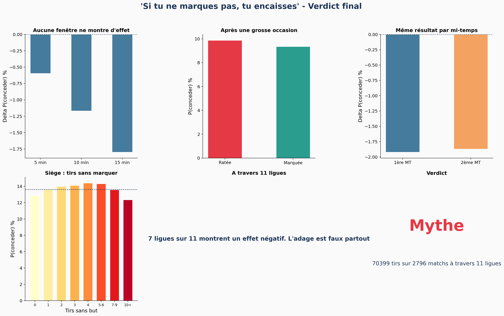

# "Si tu ne marques pas, tu encaisses" — Mythe ou réalité ?

> Test empirique de l'adage le plus célèbre du football sur **70 000 tirs**, **2 800 matchs** et **10 compétitions**.


---

## En bref

Tous les fans de foot l'ont entendu : *« Si tu ne marques pas, tu vas encaisser. »* Les commentateurs le répètent à chaque occasion ratée. Mais est-ce **vraiment vrai** ?

À partir des données event-level de StatsBomb (1958–2024 — La Liga, Premier League, Serie A, Bundesliga, Ligue 1, finales de Ligue des Champions, Coupe du Monde, Euro, CAN, Copa America), j'ai construit un pipeline statistique complet pour tester cette affirmation.

**Le verdict :** l'adage est un **mythe statistique**. Les équipes qui accumulent du xG sans marquer ne deviennent pas plus vulnérables défensivement — l'effet observé s'explique entièrement par le hasard et le confounding de la force des équipes.

---

## Visuel principal



---

## Méthodologie

Une approche statistique multi-couches pour garantir la robustesse de la conclusion :

| Étape | Méthode | Objectif |
|---|---|---|
| **1. Descriptif** | Event study (traité vs contrôle) | Détection initiale du signal |
| **2. Stratification** | Stratification par score state | Contrôler le contexte de match |
| **3. Non-paramétrique** | Test de permutation (10 000 itérations) | Pas d'hypothèse distributionnelle |
| **4. Tests multiples** | Correction Benjamini-Hochberg | Éviter les faux positifs |
| **5. Régression** | Logistique avec clustered SE | Contrôler les variables confondantes |
| **6. Prédictif** | Cross-validation GroupKFold (AUC) | Mesurer le vrai pouvoir prédictif |
| **7. Causal** | **Null model Bernoulli (500 simulations)** | **Le test décisif** |

Le null model Bernoulli est la pièce maîtresse : chaque tir est re-simulé comme `Bernoulli(xG)`, l'underperformance est recalculée, et l'effet est mesuré dans un monde de pur hasard. Comparer cette distribution nulle à l'effet observé permet de savoir si le pattern est réel ou si ce n'est qu'une régression mécanique vers la moyenne.

---

## Résultats clés

### 1. La « malédiction de l'occasion ratée » n'existe pas
Après une grosse occasion (xG ≥ 0.4) **ratée** : 9.9% de risque de concéder dans les 10 minutes.
Après une grosse occasion **marquée** : 9.3%.
**Aucune différence significative.**

### 2. Rater un penalty te *protège*
- Après un penalty **raté** : 5.2% de risque de concéder
- Après un penalty **marqué** : 8.7%

Contre-intuitif mais logique : marquer pousse l'adversaire à se découvrir.

### 3. Le « siège » ne casse pas les défenses
Que l'équipe ait tiré 0 ou 10+ fois sans marquer, le risque de concéder reste plat autour de la moyenne (~14%).

### 4. Le résultat tient à travers les ligues et les époques
Forest plot sur 10 compétitions : **7 sur 10** montrent un effet *négatif* (gaspiller protège même légèrement), et l'effet est statistiquement indistinguable de zéro dans un monde Bernoulli.

### 5. Le piège du paradoxe de Simpson
Au niveau **équipe**, on observe une corrélation positive (r=0.31) entre gaspillage et concession. Mais elle disparaît dès qu'on analyse **minute par minute** au sein d'un même match. La corrélation au niveau équipe reflète la **force globale** de l'équipe, pas un mécanisme causal.

---

## Stack technique

```
Python 3.9+
├── Données :    pandas, numpy, pyarrow
├── Stats :      scipy, statsmodels, scikit-learn
├── Survie :     lifelines
├── Viz :        matplotlib, seaborn
├── Source :     statsbombpy (StatsBomb Open Data)
└── Workflow :   Jupyter, Git
```

---

## Structure du projet

```
football-underperformance/
├── config.yaml                 # Paramètres centralisés
├── src/
│   ├── collect.py              # Collecte StatsBomb (avec cache)
│   ├── clean.py                # Nettoyage + rapport qualité automatique
│   ├── features.py             # Construction des timelines minute-par-minute
│   ├── analysis.py             # Window analysis, permutation, stratification
│   └── models.py               # Régression logistique, survie, null model
├── notebooks/
│   ├── 01_data_exploration.ipynb
│   ├── 02_feature_engineering.ipynb
│   ├── 03_descriptive_analysis.ipynb
│   ├── 04_modeling.ipynb
│   ├── 05_publication_visuals.ipynb
│   ├── 06_multi_league.ipynb
│   └── 07_deep_dive.ipynb
├── data/                       # (gitignore — régénérable depuis StatsBomb)
├── outputs/figures/            # Toutes les figures
└── tests/                      # Tests unitaires
```

---

## Reproduire

```bash
git clone https://github.com/kayouba/football-underperformance.git
cd football-underperformance

python3 -m venv .venv
source .venv/bin/activate
pip install -r requirements.txt

# Exécuter les notebooks dans l'ordre 01 à 07
jupyter notebook notebooks/
```

Temps total : ~45 min sur un Mac récent (le bottleneck est le null model Bernoulli avec 500 simulations).

---

## Ce que ce projet démontre

Pour les recruteurs qui scannent rapidement :

| Compétence | Où la voir |
|---|---|
| **Pipeline end-to-end** | `src/`, de la donnée brute aux figures finales |
| **Rigueur statistique** | Correction tests multiples, clustered SE, GroupKFold CV |
| **Pensée causale** | Stratification, null models, conscience du paradoxe de Simpson |
| **Qualité du code** | OOP modulaire, type hints, logging, tests, config-driven |
| **Communication** | Visualisations publication-ready, narration data-driven |
| **Connaissance métier** | Sémantique du xG, confounders de game state, raisonnement foot |

---

## Pour aller plus loin

- [ ] Construire un modèle xG custom (au lieu d'utiliser celui de StatsBomb)
- [ ] API d'inférence en temps réel
- [ ] Même analyse sur basketball / hockey pour comparaison cross-sport

---

## À propos

**Kayou Ba** — Data Analyst / Data Scientist
🎓 Master MIAGE, Université de Bordeaux
🔗 [Portfolio](https://kayouba.pro) · [GitHub](https://github.com/kayouba) · [LinkedIn](https://www.linkedin.com/in/kayouba/)

Ce projet fait partie d'un portfolio orienté sports analytics et inférence causale rigoureuse. Intéressé par ce type de travail ? N'hésitez pas à me contacter.

---

*Données : [StatsBomb Open Data](https://github.com/statsbomb/open-data) — utilisées sous leur licence publique.*